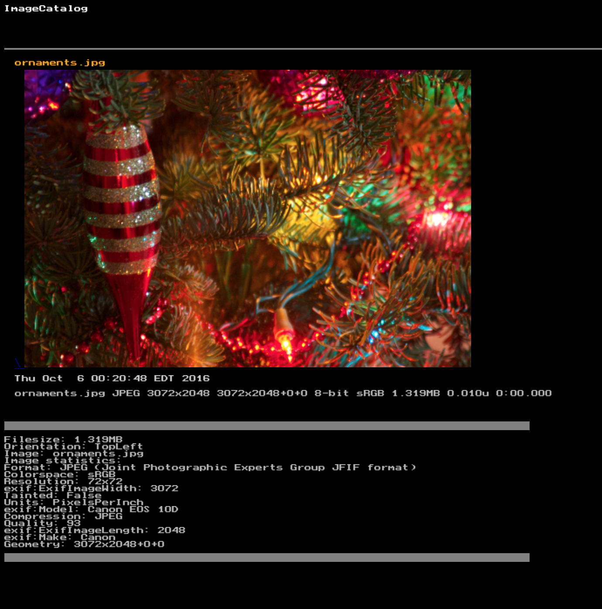

This is refactoring of a horrible old hack to create an HTML doc from a set of JPEGs :shit:

It uses 'identify' to snarf out the JPEG attributes.

These are dumped to a 'DAT' file.

The resulting DAT file is read by 'text2gif' to generate tags for the images.

***Use at your own risk***

----
#Prerequisites

**identify** - part of ImageMagick

**text2gif** - may be packaged with giflib.

Mac:

    brew install giflib imagemagick
    
Linux:

    [apt|yum] install giflib-tools imagemagick

----
#Usage

1. Clone this repository.
2. Add JPEG images to the 'imagecatalog' directory for processing, or copy imagecatalog.sh to a directory containing JPEGs.
3. ./imagecatalog.sh
4. Review the resuling **index.htm** file
4a. Reset the directory contents with 'reset.sh'
5. Serve

----
# Customizing

Exif metadata patterns are defined in 'patterns'. They are passed to '[identify](http://www.imagemagick.org/Usage/photos/#exif)' in a loop, capturing the details in a text file under the DAT directory. This file is iterated through when creating labels ('ident'  stats)

- Image
- Make
- Model
- Format
- Make
- Model
- Geometry
- Colorspace
- Resolution
- Units
- Filesize
- Compression
- Quality
- Orientation
- Signature
- Tainted

Add your own tag to 'pattern' and run imagecatalog.sh.
----
#Detritus
imagecatalog.sh leaves text files containing various attributes in the DAT and TAG subdirectories. These attributes are rendered as GIFs inline with the image.

'FULL' directory contains the full-sized image, linked from the thumbnail.

----
# Example

**Output**

	me@debian:~/Code/imagecatalog$ ./imagecatalog.sh
	Using system 'text2gif' - /usr/bin/text2gif
	Stubbing...
	Converting ornaments.jpg ...
	Grabbing 128 bytes from ornaments.jpg
	Identifying ornaments.jpg
	Creating dat file for ornaments.jpg
	Creating thumb for ornaments.jpg
	Moving full size image ornaments.jpg into FULL
	Generating tags and labels...
	Image: ornaments.jpg
	Format: JPEG (Joint Photographic Experts Group JFIF format)
	Geometry: 3072x2048+0+0
	Resolution: 72x72
	Units: PixelsPerInch
	Colorspace: sRGB
	Image statistics:
	Compression: JPEG
	Quality: 93
	Orientation: TopLeft
	exif:ExifImageLength: 2048
	exif:ExifImageWidth: 3072
	exif:Make: Canon
	exif:Model: Canon EOS 10D
	Tainted: False
	Filesize: 1.319MB
	Making web entry...
	----> index.htm

----
##Screenshot

